# AISA Application Sitemap

This document maps out the architecture and structure of the **AISA** application, covering both the frontend routes and their corresponding backend API controllers.

---

## ─── APPLICATION STRUCTURE DIAGRAM ───

```mermaid
graph TD
    %% Public Routes
    Landing["/ (Landing Page)"] --> Login["/login"]
    Landing --> Signup["/signup"]
    Landing --> Pricing["/pricing"]
    Landing --> Policy["Policies (/privacy-policy, /terms, /cookie-policy)"]
    Landing --> Shared["/share/:shareId (Shared Chats)"]
    
    %% Auth Sub-routes
    Signup --> Verify["/verification"]
    Login --> Forgot["/forgot-password"]
    Forgot --> Reset["/reset-password/:token"]

    %% Protected Dashboard Area
    Login --> Dashboard["/dashboard"]
    Signup --> Dashboard
    
    subgraph DashboardWorkspace ["/dashboard (Protected Area)"]
        Dashboard --> ChatNew["chat/new (Main Chat Workspace)"]
        Dashboard --> ChatSession["chat/:sessionId (Active Sessions)"]
        
        %% Core Tools
        Dashboard --> SocialAgent["social-agent (AI Social Media)"]
        Dashboard --> PersonalAssistant["ai-personal-assistant (AI Personal Assistant)"]
        Dashboard --> AiBase["ai-base (AI Base Knowledge & RAG)"]
        Dashboard --> Admin["admin (Admin Settings Dashboard)"]
        Dashboard --> Security["security (DevOps & Guidelines)"]
        
        %% Legal Toolkit Sub-dashboard
        Dashboard --> Legal["legal (Legal Toolkit Dashboard)"]
        subgraph LegalToolkit ["Legal Toolkit Sub-modules"]
            Legal --> LegalChat["legal/chat (AI Legal Chat)"]
            Legal --> LegalDraft["legal/draft (Draft Maker)"]
            Legal --> LegalEvidence["legal/evidence (Evidence Analysis)"]
            Legal --> LegalStrategy["legal/strategy (Litigation Strategy)"]
            Legal --> LegalContracts["legal/contracts (Compliance Review)"]
            Legal --> LegalPredictor["legal/predictor (Case Predictor)"]
            Legal --> LegalArguments["legal/arguments (Argument Builder)"]
            Legal --> LegalPrecedents["legal/precedents (Precedents Database)"]
            Legal --> LegalCompliance["legal/compliance (Regulatory Check)"]
            Legal --> LegalHearings["legal/hearings (Hearings Timeline)"]
        end
    end

    style DashboardWorkspace fill:#1e1e38,stroke:#6366f1,stroke-width:2px,color:#fff
    style LegalToolkit fill:#181825,stroke:#c084fc,stroke-width:1.5px,color:#fff
```

---

## ─── FRONTEND ROUTES MAPPING ───

### 1. Public Routes (Accessible without Authentication)

| Route Path | Component / Target | Description |
| :--- | :--- | :--- |
| `/` | `Landing.jsx` | Dynamic Landing page featuring visual grid and product features. |
| `/login` | `Login.jsx` | Sign-in portal with support for credentials, Google, Apple, and Microsoft logins. |
| `/signup` | `Signup.jsx` | User registration flow. |
| `/verification` | `VerificationForm.jsx` | Code/OTP input screen for email confirmation. |
| `/forgot-password` | `ForgotPassword.jsx` | Form to request password recovery. |
| `/reset-password/:token`| `ResetPassword.jsx` | Password reset execution screen. |
| `/pricing` | `Pricing.jsx` | Pricing and credit plans breakdown. |
| `/privacy-policy` | `Landing.jsx` | Legal privacy declaration modal. |
| `/terms` | `Landing.jsx` | Terms of service documentation. |
| `/cookie-policy` | `Landing.jsx` | Cookie usage explanation. |
| `/share/:shareId` | `SharedChat.jsx` | Publicly shareable static snapshot of chat sessions. |

### 2. Protected Dashboard Workspace (Under `/dashboard`)
*All routes below are wrapped inside `DashboardLayout` and require a valid auth token.*

| Route Path | Component / Lazy Target | Description |
| :--- | :--- | :--- |
| `/dashboard` | `Navigate` to `chat/new` | Redirects users straight to the new chat page. |
| `/dashboard/chat/new` | `Chat.jsx` | Workspace for a new session with orchestrator. |
| `/dashboard/chat/:sessionId`| `Chat.jsx` | Restores active conversation history. |
| `/dashboard/social-agent` | `SocialAgentPage.jsx` | Ad campaign planner & visual/social generator. |
| `/dashboard/ai-personal-assistant`| `Dashboard.jsx` | Productivity tools, task lists, calendar integration. |
| `/dashboard/ai-base` | `AI_Base.jsx` | Custom documents/PDFs uploader and RAG interface. |
| `/dashboard/admin` | `AdminDashboard.jsx` | Dashboard panel for system administrators. |
| `/dashboard/security` | `SecurityAndGuidelines.jsx`| Security credentials list and developer policies. |

### 3. Legal AI Toolkit Sub-Routes (Under `/dashboard/legal`)
*Part of the Legal Toolkit workspace.*

| Route Path | Component | Description |
| :--- | :--- | :--- |
| `/dashboard/legal` | `AiLegalContentRoute` | Home dashboard displaying all Legal Toolkit widgets. |
| `/dashboard/legal/chat` | `LegalChatScreenRoute` | Interactive Chat for legal consulting. |
| `/dashboard/legal/draft` | `DraftMakerRoute` | Template generator for legal notices and petitions. |
| `/dashboard/legal/evidence` | `EvidenceAnalysisRoute` | Toolkit to audit uploads and build evidence tables. |
| `/dashboard/legal/strategy` | `StrategyEngineRoute` | Contextual recommendations on litigation approaches. |
| `/dashboard/legal/contracts` | `ContractReviewRoute` | PDF contract analysis for clause discrepancies. |
| `/dashboard/legal/predictor` | `CasePredictorRoute` | AI probability analysis of legal outcomes. |
| `/dashboard/legal/arguments` | `ArgumentBuilderRoute` | Court-ready brief and opposition argument assembler. |
| `/dashboard/legal/precedents` | `LegalPrecedentsRoute` | Citation search and judgment references database. |
| `/dashboard/legal/compliance` | `ComplianceRoute` | Local regulatory requirements checkbox checks. |
| `/dashboard/legal/hearings` | `HearingsRoute` | Timeline planner for pending hearing dates. |

---

## ─── BACKEND API CONTROLLERS MAPPING ───

All API routes are served under the `https://aisa24.com/api` prefix:

### 1. Authentication & Security
- **Path prefix**: `/api/auth` (handled by `routes/authRoutes.js` and `routes/ssoRoutes.js`)
  - `POST /signup` -> Registration controller
  - `POST /login` -> Standard credentials auth
  - `POST /google` / `/apple` / `/microsoft` -> Federated OAuth login
  - `POST /forgot-password` -> Request recovery code
  - `POST /reset-password-otp` -> Update password using OTP
  - `POST /sso/generate` -> Generates Single Sign-On tokens
  - `POST /sso/handoff` -> Consumes SSO token for dashboard entry

### 2. User Settings & Management
- **Path prefix**: `/api/user` and `/api/users` (handled by `routes/user.js` and `routes/dataRoutes.js`)
  - `GET /profile` -> Retrieve user identity and personalization options
  - `PUT /profile` -> Update user email, username, preferred options
  - `POST /avatar` -> Multi-part file upload for profile picture
  - `DELETE /` -> Complete account deletion verification (GDPR compliance)

### 3. Messaging & Orchestration
- **Path prefix**: `/api/chat` and `/api/chats` (handled by `routes/chatRoutes.js` and `routes/chat.routes.js`)
  - `POST /` -> Execute chat prompts (primary AI processing endpoint)
  - `GET /history` -> Fetch user session history list
  - `DELETE /session/:id` -> Discard chat conversation logs

### 4. Custom AI Agents
- **AI Social Agent**: `/api/social-agent` -> Generates social calendars, copy, and posts.
- **AI Ad Agency**: `/api/ai-ad` -> Custom marketing configurations and deployment schedules.
- **AI Base / RAG Workspace**: `/api/aibase/knowledge` -> Manage uploads, index raw texts, query stored vector files.
- **Live Stock Feed**: `/api/stock` -> Fetches real-time price quotes (backed by WebSockets).
- **Voice Synthesis**: `/api/voice` -> Translates text queries to audio recordings.
